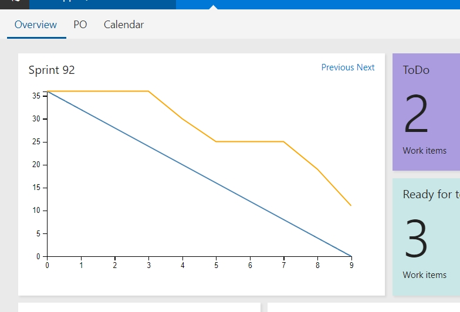

# The Real Sprint Burndown
This is a burndown chart for people using story point estimations per PBI. 

This widget is not usable for people who administer completion of work per task (but in that case you're not interested in doing estimation based work at all so don't use a burndown chart).

At the moment the plugin counts both Saturdays and Sundays as days off and aren't included in the graph.

## When to use
This plugin can be of use when you want to track the work done on your PBI's. For that you need to actively use the following VSO fields:
* Area path to your project
* Iteration path (with a start- and enddate)
* Effort field to put in the estimation

## Configuration
At the moment there are two configuration options:
* Area path, by default set to {projectname}\{teamname}. Use backslashes for your path and make sure to leave spaces there if you have any. So if you have three levels your area path would look like: level1\level 2\level3
* Included states, by default set to 'Committed','In Progress','Ready for Code Review','Ready for test','PO check'. Every PBI has a couple of states that would reflect a state in your teams sprint. Make sure that if you change this you use single quotes around your state and use comma's without spaces to seperate the states.